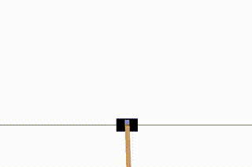
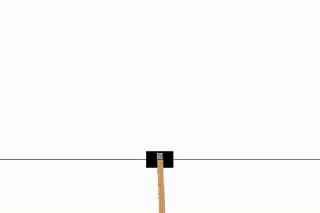

# cartpoleDQN

This repository is a little showcase of how to use the DQN-technique from Reinforcement Learning
in a classic control problem, namely, cartpole.

I created this repository because I was reading Maxim Lapan's book "Deep Reinforcement Learning Hands-on"
at the time and wanted to apply what I've learned to a different problem than explained in the book.

This is the first part of a small series of projects I intend to do on Reinforcement Learning techniques.
Each repo will be dedicated to a different technique, applied on different benchmark of gymnasium.
Additionally, I will talk a little about how these techniques work, what is the theory behind, how you can improve performance
and so on. 
I hope you'll enjoy it.

# TLDR

You can train a DQN on the cartpole gymnasium environment with three different tasks: steady, upswing and downswing.
To install the necessary dependencies, run:

    python3 -m pip install -r requirements.txt

Training is done via:

    python3 train.py --task {steady, upswing, downswing} --max-steps n

You can test the trained DQN on the environment via:

    python3 play.py --task {steady, upswing, downswing} --max-steps n --weights-file <your trained weights>

Here are examplary results:

  
  
  

# The long version

# Deep Q-Learning

Deep Q-learning is a term, first introduced in the 2013 DeepMind paper
**Playing Atari with Deep Reinforcement Learning** (https://arxiv.org/pdf/1312.5602.pdf).
In this paper, the DeepMind team first achieved to create a Reinforcement Learning (RL) agent, that could
outperform humans in cognitively and motorically challenging games such as Breakout or Pong.
Deep Q-learning is a form of Q-Learning, a RL-technique that has been around since 1989, which uses Neural Networks (NN)
to represent a Q-function.
The term DQN, which stands for Deep Q-network was also introduced in the DeepMind paper and is used
to denote a convolutional NN, specifically designed for Deep Q-learning.
DQN and Deep Q-learning are often used interchangeably and I will stick to that.
However, keep in mind that technically, DQN has a much narrower definition than Deep Q-learning.

Ok, so DQN is concerned with a Q-function. But what is a Q-function?

## Q-functions

A Q-functions is a function, that maps a state-action pair to some real number, called the Q-value:

$$ Q: s, a \rightarrow \mathbb{R} $$

The Q-functions is also called value function or state-action value function, in distinction to the state-value function V.
The output of Q is called the Q-value or state-action value.
In every state, for every possible action, the Q-function tells us the value of this action.
It can be defined recursively by the Bellmann equation:

$$ Q(s, a) = r(s, a) + \gamma * max_{a'}  Q(s', a') $$

The state-action value of the current pair (s, a) is equal to the reward obtained by doing
action a in state s + the discounted state-action value of the state s', reached by performing
the action a', that leads to the state with the highest value.
This may sound a little clumsy, but it simply means that the state-action value of the current state-action pair
(s, a) is composed of the reward r(s, a) and the state-action value obtained by choosing
the optimal action a' in state s.
The discount factor is a number between 0 and 1 (usually close to 1, e.g. 0.98) that forces the agent
to put more emphasis on states that are in the near-future than those that are in the far-future.
Once we have the Q-function for every state-action pair, we can simply choose the action a in state s,
that has the highest Q-value assigned and therefore leads to states with higher values.

So far so good, but how do we actually calculate Q?
Imagine you have a grid world with 16 states and 4 possible actions in each state.
Then there are 16*4 = 64 possible state action pairs (s, a). For each of these, we could list
the Q-value in a table. 
If we now interact with the environment and sample (s, a) pairs and rewards r, we can use the Bellmann equation 
to update the Q-value for each pair.
This is perfectly fine and will work. However, what if the number of possible states and actions gets larger?
For an environment with a thousand states and 20 possible actions, we already have 20k possible (s, a) pairs.
For an environment where the states are 300x200 pixel images, the number of possible states 
is something like 255^(300 * 200) ~ 10^(150000). Multiply that by some number of action, and you 
get a huge table!
If the number of states is not discrete but continuous, then this representation is actually impossible.
So what to do?
Before we answer that question, let us take a quick look at the cartpole environment.

## Cartpole

Cartpole is one of the classic control examples. A cart is mounted on some kind of rail and has a pole
attached to it. The goal is e.g. to keep the pole upright and the only way to influence the cart is
by applying some force to the cart itself. The pole itself is not actuated and must be controlled
via the cart itself.

This system is described by four variables:

* Cart position
* Cart velocity
* Pole angle
* Pole angular velocity

There are two possible actions:
* Apply constant force from left
* Apply constant force from right

So, a state of the cartpole comprises four real numbers. That means the number of possible
states is continuous, and it is impossible to come up with a table mapping Q-values to state-action pairs.
Even if we only consider the floats, which are a subset of the real numbers that table would still be unmanageable.

What to do?

## DQN

Here, the DQN comes into play. Instead of representing the Q-value of each (s, a) pair explicitly, we want a NN to 
learn a mapping of (s, a)-pairs to Q-values.
This mapping can be learned by sampling (s, a) pairs from the environment.
The number of parameters $\theta$ of the NN is vastly smaller than the (possibly infinite) number of Q-values that we
would need to construct a complete table. Additionally, if the NN learns a nice and smooth mapping, then states that 
are close to each other will also have Q-values that are close to each other.
For our cartpole environment, the DQN has 4 input neurons (one for each state) and 2 output neurons (one for each possible
 action). Each output corresponds to one of the Q-values.

# Training

So far we have seen what a Q-function is, how we can use it to choose good actions in the 
environment and how it can be approximated by a DQN.
Now we can get to the actual reinforcement learning, the training of the DQN.
On a high level, training an agent with DQN can be depicted as a loop:

In the beginning, we initialize the DQN parameters randomly. Then we start sampling 
from the environment. At each step, we perform an action (= apply a force to the cart).
We obtain a tuple consisting of the current state s of the environment, the applied action a,
the reward r and the next state s'.
With this tuple, we can calculate an estimate of the Q-value of the state-action pair (s, a) as:

$$ Q(s,a) = r + max_{a'} Q(s', a') $$

We can calculate the quantity Q(s', a') by putting the state s' (which we have) into the DQN and choosing
the maximum value of the two possible actions. This Q-value then becomes the target
for training the DQN in a supervised manner. Once we have updated the DQN parameters,
the process starts from anew.
We loop until the average reward we can achieve in the environment is sufficiently high.
In general, this is it and one could already go about and try to implement this loop.
However, there is a crucial detail missing, exploration. 
In the beginning, since we randomly initialized the DQN parameters, the Q-values it will
produce will be very bad estimates of the real Q-values. 
This means, that the actions we apply in the environment will in general be very bad. 
But if we choose bad actions, then we won't get much reward and will not be able to improve
the Q-value estimates. It is therefore easy to get stuck in a loop of bad actions.
To prevent this, exploration is very important in the beginning. Exploration in this case means,
not to choose the action that has the highest Q-value assigned to it, but a random action.
By exploring a lot in the beginning, we can get good estimates for Q-values. Later, if we are
confident that the estimates are good enough, we can turn down exploration and choose the action
with the highest Q-value more often.

## Training the DQN

The actual training is done in train.py
You can choose one of three tasks: steady, upswing and downswing
In the steady task, the pole starts in a somewhat upright position and the goal is to keep it steady.
If the pole falls down, the episode is over. In the harder upswing task, the pole starts hanging down and
the goal is to swing it up and then keep it there. Downswing is the opposite of upswing. The pole starts in
a somewhat upright position and the task is to stabilize it in the downwards position as fast as possible.
The cartpole environment is simulated with gymnasium, the DQN is implemented in pytorch.

You can start training with the command:

    python3 train.py --task {steady, upswing, downswing} --max-steps n

The `max-steps` parameter is the maximum number of steps for each episode in the cartpole environment.
The steady task is rather easy to master. The reward is 1 for each timestep at which the pole is still upright.

I included a Tensorboard logger in the training process. Tensorboard is a nice tool that
allows recording and visualizing different parameters and metrics during training.
With it, you can compare the training process for different hyperparameters like the learning
rate or batch size.

Here you can see a screenshot of different runs logged in Tensorboard.

The upswing and downswing tasks are somewhat harder. Here, the reward is more complicated. You need to design
a reward that captures what you want the goal to be.
For example, if you want the pole to be upright, you need to give higher reward to states 
where the pole is upright (angle ~ 0°) and lower reward to states where the pole hangs down (angle ~ 180°).
If you additionally want the cart to stay in the middle of the track, you can give higher
rewards for staying in the middle (x=0) and lower rewards for moving away from the middle (x > 0 | x < 0).
There are some subtleties in designing the reward function that one can easily trip over.
For example, when the agent only gets reward for keeping the pole upright, it might try to maximize the time the pole
is upright by spinning it as fast as possible:

You can prevent this e.g. by adding a term that punishes high angular velocities.

The magnitude of the reward also matters. For example, if you give a negative reward for moving away from the middle and this reward
is higher in magnitude than the positive reward the agent gets for keeping the pole upright; the agent might try
to move the cart out of bounds as fast as possible to end the episode and to keep the negative reward
as low as possible:

Once the training is finished, the weights of the DQN will be saved to a .pth file.

## Running the trained policies

Finally, if you want to run the trained policies, you can do so by executing:

    python3 play.py --task {steady, upswing, downswing} --max-steps n --weights-file <your trained weights>

